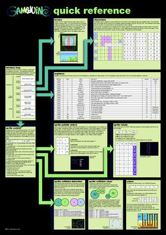

gameduino
=========

What is it?
-----------

Gameduino is a game adapter for Arduino - or anything else with an SPI interface - built as a single shield that stacks up on top of the Arduino and has plugs for a VGA monitor and stereo speakers.

Legal stuffs
------------

This project was created by James Bowman <jamesb@excamera.com>. I strongly recommand you to visit his website first as it always will contain the more recent and official information about the Gameduino: http://excamera.com/sphinx/gameduino/index.html

Why this repo?
--------------

This github repository is maintained by Manoel Trapier <godzil@godzil.net> for his own project around Gameduino and by the fact there is missing a central repository with all needed file to build/hack your own Gameduino on Internet. James' website will of course store all of thoses files, but they are stored sparses around, and could be difficult to find.

More informations on Gameduino
-----------------------------

The sound and graphics are definitely old-school, but thanks to the latest FPGA technology, the sprite capabilities are a step above those in machines from the past.

video output is 400x300 pixels in 512 colors
all color processed internally at 15-bit precision
compatible with any standard VGA monitor (800x600 @ 72Hz)
background graphics
512x512 pixel character background
256 characters, each with independent 4 color palette
pixel-smooth X-Y wraparound scroll
foreground graphics
each sprite is 16x16 pixels with per-pixel transparency
each sprite can use 256, 16 or 4 colors
four-way rotate and flip
96 sprites per scan-line, 1536 texels per line
pixel-perfect sprite collision detection
audio output is a stereo 12-bit frequency synthesizer
64 independent voices 10-8000 Hz
per-voice sine wave or white noise
sample playback channel
The adapter is controlled via SPI read/write operations, and looks to the CPU like a 32Kbyte RAM. (Unlike many 8-bit machines, there are no restrictions on when you can access this RAM). There is a handy reference poster showing how the whole system works, and a set of sample programs and library.

Contents
--------

You will find here all the data I've collected about the original Gameduino:
 - board/	contain the schematic and PCB design for the Gameduino
 - doc/		Documentation about the Gameduino and j1 CPU
 - fpga/	The FPGA source for the Gameduino
 - gd/		The Arduino library for the Gameduino
 - Python/	A set of tool writen in Python
 - j1/		The original j1 CPU with it's firmware and FPGA source
 - j0/		The slightly modified j1 CPU for the Gameduino, as the j0 is part of the Gameduino, only the firmware part is accessible here
 - archives/    Raw files found on James' website

Licensing
---------

Gameduino is open-source hardware (BSD license) and all its code is GPL licensed.
